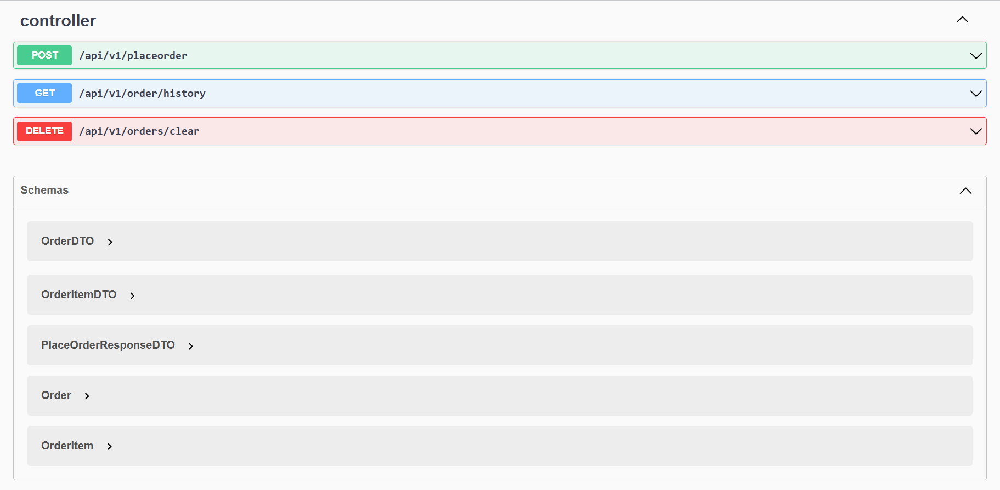

# 🛒 Spring Boot Microservices E-Commerce Backend

This is a simple e-commerce backend project built using Spring Boot and follows a microservices architecture. It consists of four core services:

- 🏷️ **Product Service**
- 🧮 **Inventory Service**
- 🛍️ **Cart Service**
- 📦 **Order Service**

Each service is independently deployed and connected via synchronous HTTP communication using Spring WebClient. The backend uses **MySQL** as the database for all services.

---

## 📌 How the System Works

1. **Shop owner adds inventories** to the Inventory Service using a product ID.
2. **Products are added** to the Product Service with details like name, description, and price.
3. **Users can add products to the cart**, which calculates the total price (product price × quantity) by calling the Product Service.
4. **Cart summary** allows users to view all items in the cart and the final bill.
5. **When placing an order**, the system:
   - Retrieves cart items.
   - Validates inventory availability.
   - If stock is sufficient, creates the order, reduces inventory and cart clear automatically.
   - If stock is insufficient, the order fails with an appropriate message.
6. **Order history** can be viewed or cleared.

---

## 📦 API Reference

### 🧮 INVENTORY SERVICE

| Action | Endpoint | Method | Request Body |
|--------|----------|--------|---------------|
| Add Inventory | `/api/v1/addinventory` | `POST` | ```json { "id": 3, "inventoryId": 1003, "productId": 2003, "quantity": 100 } ``` |
| Get All Inventories | `/api/v1/getinventories` | `GET` | - |
| Get Inventory by Product ID | `/api/v1/inventory/{productId}` | `GET` | - |
| Delete Inventory by Product ID | `/api/v1/deleteinventory/{productId}` | `DELETE` | - |

---

### 🏷️ PRODUCT SERVICE

| Action | Endpoint | Method | Request Body |
|--------|----------|--------|---------------|
| Add Product | `/api/v1/addproduct` | `POST` | ```json { "id": 2, "productId": 2002, "productName": "Chocolate marie", "description": "Chocolate biscuit", "price": 100 } ``` |
| Update Product | `/api/v1/addproduct` | `POST` | (Same as Add Product) |
| Delete Product by Product ID | `/api/v1/deleteproduct/{productId}` | `DELETE` | - |
| Delete All Products | `/api/v1/deleteall` | `DELETE` | - |
| Get All Products | `/api/v1/getproducts` | `GET` | - |

---

### 🛍️ CART SERVICE

| Action | Endpoint | Method | Request Body |
|--------|----------|--------|---------------|
| Add to Cart | `/api/v1/addcartitem` | `POST` | ```json { "id": 3, "productId": 2002, "quantity": 100 } ``` |
| Get Cart Items | `/api/v1/getcart` | `GET` | - |
| Get Cart Summary | `/api/v1/cart/summary` | `GET` | - |
| Clear Cart | `/api/v1/cart/clear` | `DELETE` | - |

---

### 📦 ORDER SERVICE

| Action | Endpoint | Method | Request Body |
|--------|----------|--------|---------------|
| Place Order | `/api/v1/placeorder` | `POST` | - |
| Get Order History | `/api/v1/order/history` | `GET` | - |
| Clear Order History | `/api/v1/orders/clear` | `DELETE` | - |

---

## 📲 Swagger UI
- http://localhost:8081/swagger-ui/index.html#/

 

- http://localhost:8082/swagger-ui/index.html#/


- http://localhost:8083/swagger-ui/index.html#/


- http://localhost:8084/swagger-ui/index.html#/



## 🛠️ Tech Stack

- Java 17
- Spring Boot
- Spring WebClient
- Spring Data JPA
- MySQL
- REST API
- Maven

---

## 🔒 Authentication & Authorization (Planned)

The next development phase will introduce:
- User authentication (login, registration)
- Role-based access control
  - Admin can manage products and inventory
  - Users can manage cart and place orders

---

## 🚀 How to Run

1. Clone this repo
2. Configure `application.properties` or `application.yml` in each service
3. Run each Spring Boot service independently
4. Use Postman or a frontend to test endpoints

---

## ✅ Future Improvements

- Add **Spring Security** for role-based user authentication
- Implement **API Gateway** and **Service Registry** with Spring Cloud
- Add **JWT Token** support
- Add **Swagger UI** for API documentation
- Implement **Kafka** or **RabbitMQ** for async messaging

---


